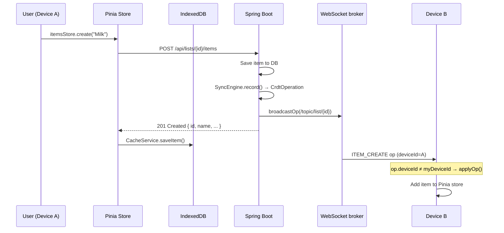
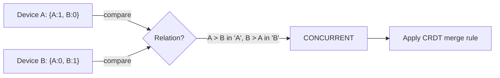
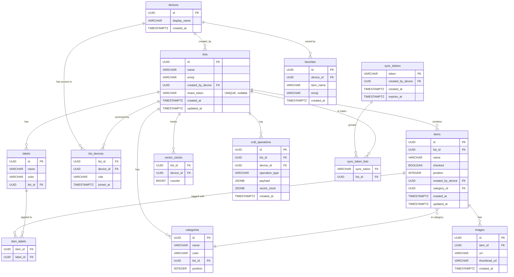

# ListMe — Developer Architecture Guide

> **Audience:** Every developer joining the project.
> **Goal:** After reading this, you should be able to open any file in the repo and immediately understand why it exists and how it connects to everything else.

---

## Table of Contents

1. [What Is This App?](#1-what-is-this-app)
2. [The Big Picture](#2-the-big-picture)
3. [Core Concepts You Must Understand](#3-core-concepts-you-must-understand)
   - [3.1 Account-Free Device Identity](#31-account-free-device-identity)
   - [3.2 Offline-First Architecture](#32-offline-first-architecture)
   - [3.3 CRDTs — Conflict-Free Replication](#33-crdts--conflict-free-replication)
   - [3.4 Vector Clocks — Tracking Causality](#34-vector-clocks--tracking-causality)
   - [3.5 Real-Time Sync with WebSocket/STOMP](#35-real-time-sync-with-websocketstomp)
4. [Tech Stack](#4-tech-stack)
5. [Dev Environment Setup](#5-dev-environment-setup)
6. [Codebase Map](#6-codebase-map)
7. [Database Schema](#7-database-schema)
8. [API Reference](#8-api-reference)
9. [Data Flow Walkthroughs](#9-data-flow-walkthroughs)
10. [Implementation Phases](#10-implementation-phases)
11. [Testing Strategy](#11-testing-strategy)
12. [Sources & References](#12-sources--references)

---

## 1. What Is This App?

**ListMe** is a collaborative shopping list app that works fully offline and syncs automatically when internet is available. Think Google Docs for shopping lists — multiple people can edit the same list simultaneously, even without a connection, and changes merge together without conflicts.

The three-sentence architecture:

> Each device generates a random identity (no accounts). All mutations are stored as a log of operations using **CRDTs** (Conflict-free Replicated Data Types), keyed by **vector clocks** to track causality. The server is a **relay + backup** — it doesn't own the truth, every device does.

---

## 2. The Big Picture

```
┌─────────────────────────────────────────────────────────────────────┐
│                        USER'S DEVICES                               │
│                                                                     │
│  ┌─────────────────────┐       ┌─────────────────────┐             │
│  │   Browser / PWA     │       │   Browser / PWA     │             │
│  │                     │       │                     │             │
│  │  Vue 3 + Pinia      │       │  Vue 3 + Pinia      │             │
│  │  ┌───────────────┐  │       │  ┌───────────────┐  │             │
│  │  │  IndexedDB    │  │       │  │  IndexedDB    │  │             │
│  │  │ (Dexie)       │  │       │  │ (Dexie)       │  │             │
│  │  │  · lists      │  │       │  │  · lists      │  │             │
│  │  │  · items      │  │       │  │  · items      │  │             │
│  │  │  · op queue   │  │       │  │  · op queue   │  │             │
│  │  └───────────────┘  │       │  └───────────────┘  │             │
│  └────────┬────────────┘       └────────┬────────────┘             │
│           │  HTTP + WebSocket            │  HTTP + WebSocket        │
└───────────┼──────────────────────────────┼──────────────────────────┘
            │                              │
            ▼                              ▼
┌───────────────────────────────────────────────────────┐
│                   Spring Boot Backend                 │
│                                                       │
│  REST Controllers   WebSocket (STOMP)                 │
│  ┌────────────┐    ┌─────────────────────────────┐    │
│  │ ListCtrl   │    │ /topic/list/{id}            │    │
│  │ ItemCtrl   │    │ /topic/list/{id}/presence   │    │
│  │ ShareCtrl  │    │ /app/list/{id}/join         │    │
│  │ SyncCtrl   │    │ /app/list/{id}/leave        │    │
│  └─────┬──────┘    └──────────────┬──────────────┘    │
│        │                          │                    │
│  ┌─────▼──────────────────────────▼──────────────┐    │
│  │              SyncEngine (CRDT core)           │    │
│  │  · record() — snapshot vector clock + persist │    │
│  │  · applyIncoming() — idempotent merge         │    │
│  │  · getOperationsSince() — pull catchup        │    │
│  └─────────────────────┬─────────────────────────┘    │
│                        │                               │
└────────────────────────┼───────────────────────────────┘
                         │
                         ▼
             ┌───────────────────────┐
             │    PostgreSQL 16      │
             │                      │
             │  devices             │
             │  lists               │
             │  items               │
             │  list_devices        │
             │  vector_clocks       │
             │  crdt_operations     │
             │  sync_tokens         │
             └───────────────────────┘
```

### How data flows end-to-end



---

## 3. Core Concepts You Must Understand

### 3.1 Account-Free Device Identity

**There are no user accounts, no login, no passwords.**

On first load, the frontend generates a random UUID using `crypto.randomUUID()` and stores it in IndexedDB forever. This UUID is the device's permanent identity.

```
Browser opens for first time
        │
        ▼
getDeviceId() checks IndexedDB
        │
  not found ──► generate crypto.randomUUID()
        │              └─► store in IndexedDB
  found ◄───────────────────────────────────┘
        │
        ▼
Every HTTP request: X-Device-Id: <uuid>
Every WebSocket:    ?deviceId=<uuid>
```

**Backend side** (`DeviceArgumentResolver.java`): The `@CurrentDevice` annotation on every controller method reads the `X-Device-Id` header and auto-creates a `Device` row in the DB if it doesn't exist yet. No registration endpoint needed.

**Why this matters for the CRDT:** The device UUID is the key in every vector clock. `{deviceA: 5, deviceB: 3}` means "device A has made 5 operations, device B has made 3 operations that we know about."

**Sharing a list:**

1. User taps "Share" → `POST /api/lists/{id}/share` → server generates a 12-character random token
2. Share link: `listme.app/s/Xk9mP2`
3. Another device opens it → `POST /api/share/{token}/join` → that device is added to `list_devices`
4. Both devices now sync in real-time via WebSocket

**Cross-device sync (same person, multiple devices):**

1. `POST /api/sync` → groups all your lists under a 24-character sync token
2. Open on new device → `POST /api/sync/{token}/apply` → all lists transferred

> **Source:** The account-free model is consistent with the "local-first software" philosophy articulated by Kleppmann et al. (2019): _"In local-first software, the availability of another user's computer does not limit what you can do on your own computer."_ [^1]

---

### 3.2 Offline-First Architecture

**Rule:** The app must be fully usable with zero network connectivity. The server is a sync mechanism, not a requirement.

We achieve this in four layers:

| Layer          | Mechanism                                             | Files                                       |
| -------------- | ----------------------------------------------------- | ------------------------------------------- |
| **App shell**  | Service Worker (Workbox) caches all JS/CSS/HTML       | `vite.config.ts` → VitePWA                  |
| **Read data**  | IndexedDB (Dexie) serves cached lists/items instantly | `services/cache.ts`, `services/db.ts`       |
| **Write data** | Mutations apply locally + enqueue CRDT op             | `stores/items.ts`, `crdt/OperationQueue.ts` |
| **Reconnect**  | `useSyncQueue` flushes queue on `online` event        | `composables/useSyncQueue.ts`               |

#### The offline write path (added in Phase 5)

Before Phase 5, going offline and adding an item would throw an unhandled error. Now:

```
User adds item while offline
         │
         ▼
itemsStore.create() → HTTP POST → network error
         │
   isNetworkError? ──► No ──► re-throw (server error, don't swallow)
         │
        Yes
         │
         ▼
1. Generate itemId = crypto.randomUUID()       ← client owns the ID
2. Build Item object with that ID
3. Push to Pinia store  ← UI updates instantly
4. CacheService.saveItem()  ← survives page refresh
5. LocalClockService.getNextClock()  ← increment per-list counter
6. OperationQueue.enqueue(ITEM_CREATE op)  ← persisted to IndexedDB
         │
         ▼
         (time passes, connectivity returns)
         │
         ▼
isOnline watcher fires → useSyncQueue.flushQueue()
         │
         ▼
POST /api/lists/{id}/crdt/ops  [{ id, operationType, payload, vectorClock }]
         │
         ▼
SyncEngine.applyIncoming()  ← idempotent, uses op UUID as dedup key
         │
         ▼
itemsStore.fetchAll()  ← reconcile local state with server truth
```

**Key design decision:** Offline creates use a client-generated UUID as the item ID. The backend's `applyIncoming()` case for `ITEM_CREATE` creates the item with `item.setId(UUID.fromString(itemId))` — the server respects the client's ID. This prevents duplicates and makes the queue flush idempotent.

> **Source:** Shapiro et al. (2011) describe this as the essential property: _"the system can continue to be used while disconnected from the network, and [...] any two replicas that have received the same set of updates are in the same state."_ [^2]

---

### 3.3 CRDTs — Conflict-Free Replication

**The problem:** Alice unchecks "Milk" while offline. Bob renames "Milk" to "Organic Milk" while offline. They reconnect. Whose change wins?

**The answer:** Both. CRDTs define merge rules so that any order of applying operations produces the same final state. This property is called **strong eventual consistency (SEC).**

> _"A CRDT is a data structure [...] where replicas can be updated independently and concurrently without coordination, and where it is always mathematically possible to resolve inconsistencies that might result."_ — Shapiro et al. [^2]

#### CRDT types used in ListMe

| Type                                | Used for                                   | Merge rule                                    |
| ----------------------------------- | ------------------------------------------ | --------------------------------------------- |
| **LWW-Register** (Last-Write-Wins)  | Item name, checked status, list name/emoji | Highest timestamp wins; tie-break by deviceId |
| **RGA** (Replicated Growable Array) | Item ordering (planned)                    | Concurrent inserts ordered by element ID      |
| **OR-Set** (Observed-Remove Set)    | List participants                          | Add wins over concurrent remove               |
| **PN-Counter**                      | Likes/votes (planned)                      | Sum of positive and negative counters         |

#### How it's implemented

Every mutation creates a `CrdtOperation` record:

```json
{
  "id": "550e8400-e29b-41d4-a716-446655440000",
  "listId": "...",
  "deviceId": "...",
  "operationType": "ITEM_UPDATE",
  "payload": {
    "itemId": "...",
    "name": "Organic Milk",
    "timestamp": 1709042400000
  },
  "vectorClock": { "device-A": 3, "device-B": 1 },
  "createdAt": "2026-02-26T10:00:00Z"
}
```

The `crdt_operations` table is an **append-only log** — operations are never deleted (only pruned after a retention period). This log is the ground truth. The `items` table is a materialised view derived from applying the log.

**LWW resolution in `SyncEngine.applyEffect()`:**

```java
case "ITEM_UPDATE" -> {
    // LWW: only update if incoming timestamp is newer
    long incomingTs = toLong(payload.get("timestamp"));
    long localTs = item.getUpdatedAt().toEpochMilli();
    if (incomingTs >= localTs) {
        item.setName(name);
        itemRepository.save(item);
    }
}
```

Both Alice's rename and Bob's concurrent edit get stored in the operation log. The one with the higher timestamp wins in the materialised `items` table. Neither operation is lost — they're both in the log for audit and conflict UI.

---

### 3.4 Vector Clocks — Tracking Causality

**The problem:** Timestamps alone are unreliable across distributed devices (clocks drift, users travel time zones). We need a way to know whether operation A _caused_ operation B, or whether they happened _concurrently_ and might conflict.

**Solution:** Vector clocks, introduced by Fidge (1988) and independently by Mattern (1989). [^3][^4]

A vector clock is a map of `{ deviceId → counter }`. Every device maintains its own counter per list and increments it on every write.

```
Initial state:  { A: 0, B: 0 }

Device A creates item:    { A: 1, B: 0 }   ← A's op #1
Device B renames item:    { A: 0, B: 1 }   ← B's op #1

Are these concurrent?
  A's clock: { A: 1, B: 0 }
  B's clock: { A: 0, B: 1 }
  A has greater A, B has greater B → CONCURRENT → CRDT merge needed ✓
```

The comparison logic (identical in both Java and TypeScript):

```
EQUAL      → clocks are identical
BEFORE     → this.every(d => this[d] ≤ other[d]) && exists d: this[d] < other[d]
AFTER      → reverse of BEFORE
CONCURRENT → neither dominates (both have at least one greater counter)
```



**In practice:** Vector clocks **detect** conflicts. CRDTs **resolve** them. They work together:

1. `SyncEngine.record()` snapshots the current vector clock and stores it with each op
2. `ConflictDetector.detectConflicts()` finds pairs of ops on the same item that are CONCURRENT
3. The merge strategy (LWW, OR-Set, etc.) determines the final state

> _"Vector clocks allow us to detect when events are concurrent [...] and therefore may need to be reconciled."_ — Kleppmann, _Designing Data-Intensive Applications_ (2017) [^5]

---

### 3.5 Real-Time Sync with WebSocket/STOMP

When two devices are online simultaneously, changes propagate in sub-second time via WebSocket.

**Protocol:** STOMP (Simple Text Oriented Messaging Protocol) over WebSocket. STOMP adds a pub/sub layer on top of raw WebSocket — clients subscribe to _topics_ and the server broadcasts to all subscribers. [^6]

**Topic layout:**

| Topic                           | Direction        | Payload                 |
| ------------------------------- | ---------------- | ----------------------- |
| `/topic/list/{listId}`          | Server → clients | `CrdtOperationResponse` |
| `/topic/list/{listId}/presence` | Server → clients | `PresenceMessage`       |
| `/app/list/{listId}/join`       | Client → server  | (empty)                 |
| `/app/list/{listId}/leave`      | Client → server  | (empty)                 |

**Connection flow:**

```
ListDetailView mounts
       │
       ▼
useListSync.startSync(listId)
       │
       ▼
connectWebSocket()    ← idempotent, uses STOMP.js Client
       │
       ├── subscribe /topic/list/{listId}           ← CRDT ops
       └── subscribe /topic/list/{listId}/presence  ← who's online
       │
       ▼
send /app/list/{listId}/join    ← announce presence
```

**The deduplication rule:** Every `CrdtOperationResponse` contains the `deviceId` that created it. On the receiving side:

```typescript
// useListSync.ts
if (op.deviceId === myDeviceId) return; // skip own broadcasts
applyOp(listId, op, itemsStore);
```

This prevents the double-add bug where your own item appears twice (once from the HTTP response that already updated the store, and again from the WebSocket broadcast). [^7]

**Presence tracking:** The server holds an in-memory `PresenceTracker` (a `ConcurrentHashMap<UUID, Set<String>>`). When a WebSocket session disconnects, the `SessionDisconnectEvent` listener removes the device from all tracked lists. This is kept in-memory on purpose — presence is ephemeral and doesn't need to survive a server restart.

---

## 4. Tech Stack

### Backend

| Technology                  | Version   | Purpose                        |
| --------------------------- | --------- | ------------------------------ |
| Java                        | 17        | Language                       |
| Spring Boot                 | 4.0.2     | Application framework          |
| Spring WebSocket + STOMP    | (bundled) | Real-time messaging            |
| Spring Data JPA + Hibernate | (bundled) | ORM / database access          |
| PostgreSQL                  | 16        | Persistence                    |
| Flyway                      | (bundled) | Database migrations            |
| Lombok                      | latest    | Boilerplate reduction          |
| TestContainers              | latest    | Integration tests with real DB |
| Maven                       | 3.9       | Build tool                     |

### Frontend

| Technology                | Version | Purpose                        |
| ------------------------- | ------- | ------------------------------ |
| Vue 3                     | 3.5     | UI framework (Composition API) |
| TypeScript                | 5.9     | Type safety                    |
| Vite                      | 7       | Build tool + dev server        |
| Pinia                     | 3       | State management               |
| Vue Router                | 4       | Client-side routing            |
| Axios                     | latest  | HTTP client                    |
| STOMP.js                  | latest  | WebSocket/STOMP client         |
| Dexie                     | 4       | IndexedDB wrapper              |
| Yjs                       | latest  | CRDT library (future use)      |
| Tailwind CSS              | 4       | Utility-first styling          |
| Catppuccin Frappe         | —       | Design system / colour palette |
| vite-plugin-pwa (Workbox) | latest  | Service Worker + PWA manifest  |
| Vitest                    | 4       | Unit testing                   |
| Inter                     | —       | Typography                     |

### Infrastructure

| Technology              | Purpose                |
| ----------------------- | ---------------------- |
| Docker + Docker Compose | Local dev environment  |
| PostgreSQL 16 (Docker)  | Local database         |
| AWS Lightsail           | Production hosting     |
| Terraform               | Infrastructure as code |
| GitHub Actions          | CI/CD                  |
| CloudFront + S3         | CDN + image storage    |

---

## 5. Dev Environment Setup

### Prerequisites

- Docker Desktop installed and running
- Git

### Start everything

```bash
git clone <repo> && cd listme
docker compose up
```

That's it. Docker Compose starts three containers:

| Service    | URL                   | What it does                         |
| ---------- | --------------------- | ------------------------------------ |
| Frontend   | http://localhost:5173 | Vue dev server with Vite HMR         |
| Backend    | http://localhost:8080 | Spring Boot with live logs           |
| PostgreSQL | localhost:5432        | Database (persists in Docker volume) |

Source code is volume-mounted, so:

- **Frontend:** edits hot-reload instantly via Vite HMR [^8]
- **Backend:** requires `docker compose restart backend` after Java changes (Maven recompiles)

### Database access

```bash
docker exec -it listme-db psql -U listme -d listme
```

### View backend logs

```bash
docker compose logs -f backend
```

### Running frontend tests

```bash
cd listme-frontend
npm install
npm run test        # Vitest (unit)
npm run test:e2e    # Playwright (when configured)
```

### Running backend tests

```bash
cd listme-backend
./mvnw test         # Requires Docker (TestContainers spins up PostgreSQL)
```

### Troubleshooting

**Port already in use:**

Port 8080 (backend) and 5173 (frontend) are configured in `docker-compose.yml`. If another process is using them:

```bash
# Windows
netstat -ano | findstr :8080

# macOS / Linux — pipe netstat output through grep to filter by port
netstat -tulpn | grep :8080
```

Or change the host port in `docker-compose.yml` (e.g., `"8081:8080"`).

**Searching logs for errors:**

```bash
# grep through backend logs for any ERROR lines
docker compose logs backend | grep -i error

# grep for a specific exception class
docker compose logs backend | grep "NullPointerException"
```

**Backend won't start (DB not ready):**

Docker Compose already waits for PostgreSQL's healthcheck before starting the backend. If it still crashes:

```bash
docker compose restart backend
```

**npm errors / node_modules corruption:**

```bash
docker compose down -v   # removes volumes including cached node_modules
docker compose up        # reinstalls from scratch
```

**Database in a bad state (schema drift, failed migration):**

```bash
docker compose down -v   # wipes the postgres volume
docker compose up        # Flyway runs all migrations fresh
```

---

## 6. Codebase Map

### Backend — `listme-backend/src/main/java/com/oliwier/listmebackend/`

```
api/                          ← HTTP controllers + DTOs
│
├── ListController.java        CRUD for shopping lists
├── ItemController.java        CRUD for items + toggle-check
├── DeviceController.java      GET /devices/me (device info)
├── ShareController.java       Share token generation + join
├── SyncTokenController.java   Cross-device sync token
├── CategoryController.java    CRUD for per-list categories
├── SyncController.java        CRDT pull/push endpoints
│
└── dto/
    ├── CrdtOperationResponse  What the server broadcasts (includes deviceId)
    ├── ItemResponse           Item as seen by the client
    └── ...

crdt/                         ← Core CRDT logic (no Spring dependencies)
│
├── VectorClock.java           Immutable vector clock (increment, merge, compare)
├── SyncEngine.java            Records ops, applies incoming, catchup queries
├── ConflictDetector.java      Finds CONCURRENT op pairs (for conflict UI)
├── IncomingOperation.java     DTO for ops pushed from client → server
└── OperationType.java         Enum: ITEM_CREATE, ITEM_UPDATE, ITEM_CHECK, ...

domain/
│
├── model/                    ← JPA entities (one per DB table)
│   ├── Device.java
│   ├── ShoppingList.java
│   ├── Item.java
│   ├── Category.java
│   ├── CrdtOperation.java     The operation log entry
│   ├── VectorClockEntry.java  Per-(list, device) counter
│   └── SyncToken.java
│
├── repository/               ← Spring Data repositories
│   ├── ItemRepository.java
│   ├── CrdtOperationRepository.java
│   └── ...
│
└── service/                  ← Business logic
    ├── ItemService.java       Mutations → records CRDT ops → broadcasts
    ├── ShareService.java      Token generation (12-char random)
    ├── SyncTokenService.java  Token generation (24-char, 30-day expiry)
    └── CategoryService.java

websocket/                    ← STOMP infrastructure
│
├── WebSocketConfig.java       Enables STOMP, /ws/websocket endpoint
├── DeviceHandshakeInterceptor Extracts deviceId from ?deviceId= query param
├── SyncMessageHandler.java    Handles /app/list/{id}/join|leave
├── ListSyncBroadcaster.java   convertAndSend to /topic/list/{id}
└── PresenceTracker.java       In-memory ConcurrentHashMap of online devices

identity/
├── CurrentDevice.java         @CurrentDevice annotation
└── DeviceArgumentResolver     Resolves annotation → auto-creates Device row

config/
└── (WebSocket, CORS, Security configs)
```

### Frontend — `listme-frontend/src/`

```
views/                        ← Full-page components (one per route)
│
├── HomeView.vue               List of all your lists with FAB + AddListModal
└── ListDetailView.vue         Single list with items, presence, ConnectionBanner

components/
│
├── common/
│   ├── AppHeader.vue          Glassmorphism top bar
│   ├── BottomNav.vue          iOS-style bottom navigation
│   ├── FloatingActionButton   Pulse-animated FAB
│   ├── AddListModal.vue       Bottom sheet: name + emoji picker
│   └── ConnectionBanner.vue   Offline / syncing / connected strip
│
├── list/
│   ├── ListCard.vue           Progress bar + participant count card
│   └── ListSection.vue        Section header ("Geteilt mit mir" etc.)
│
└── item/
    ├── ItemRow.vue            Checkbox + name + edit/delete swipe actions
    └── AddItemSheet.vue       Bottom sheet: add or edit an item

stores/                       ← Pinia stores (reactive global state)
│
├── lists.ts                   All shopping lists; cache-first fetch
├── items.ts                   Items per list; offline write path + queue
└── presence.ts                Online device counts per list

services/                     ← Pure logic, no Vue reactivity
│
├── api.ts                     Axios instance; injects X-Device-Id header
├── device.ts                  getDeviceId() → IndexedDB singleton
├── list.ts                    HTTP calls for list CRUD
├── item.ts                    HTTP calls for item CRUD
├── websocket.ts               STOMP.js client (connect, subscribe, send)
├── db.ts                      Dexie schema (lists, items, localClocks tables)
├── cache.ts                   CacheService — read/write IndexedDB
└── clock.ts                   LocalClockService — per-list clock counter

composables/                  ← Vue composition utilities
│
├── useOffline.ts              Module-level isOnline ref (window online/offline)
├── useListSync.ts             WebSocket lifecycle for one list view
└── useSyncQueue.ts            Watches isOnline, flushes OperationQueue on reconnect

crdt/                         ← Frontend CRDT logic (mirrors backend)
│
├── types.ts                   CrdtOperation, OperationType, VectorClockMap
├── VectorClock.ts             Same logic as backend VectorClock.java
├── ConflictDetector.ts        Finds concurrent op pairs (for future conflict UI)
└── OperationQueue.ts          IndexedDB-backed queue for offline ops

router/index.ts               /  → HomeView, /list/:id → ListDetailView
```

---

## 7. Database Schema



### Key design decisions

- **`crdt_operations` is append-only.** Operations are stored with their `payload` and `vector_clock` as JSONB. The `items` table is a _materialised view_ derived from replaying these operations. Never delete from `crdt_operations` (except for pruning very old synced ops).
- **`vector_clocks` is a live counter table.** One row per `(list_id, device_id)` pair. `SyncEngine.record()` increments this before snapshotting.
- **IDs are UUIDs everywhere.** This allows clients to generate IDs offline without coordination.
- **`list_devices` controls access.** Every API endpoint checks `listDeviceRepository.existsByListIdAndDeviceId()`. No row = no access.

---

## 8. API Reference

### Device Identity

| Method | Path              | Description             |
| ------ | ----------------- | ----------------------- |
| `GET`  | `/api/devices/me` | Get current device info |

All endpoints read `X-Device-Id` header and auto-create the device if new.

### Lists

| Method   | Path              | Description                             |
| -------- | ----------------- | --------------------------------------- |
| `GET`    | `/api/lists`      | All lists for this device               |
| `POST`   | `/api/lists`      | Create list `{ name, emoji? }`          |
| `GET`    | `/api/lists/{id}` | Get single list                         |
| `PUT`    | `/api/lists/{id}` | Update `{ name, emoji }`                |
| `DELETE` | `/api/lists/{id}` | Leave list (hard-delete if last member) |

### Items

| Method   | Path                                   | Description                         |
| -------- | -------------------------------------- | ----------------------------------- |
| `GET`    | `/api/lists/{id}/items`                | All items (ordered by position)     |
| `POST`   | `/api/lists/{id}/items`                | Create item `{ name, categoryId? }` |
| `PUT`    | `/api/lists/{id}/items/{itemId}`       | Update item                         |
| `PATCH`  | `/api/lists/{id}/items/{itemId}/check` | Toggle checked                      |
| `DELETE` | `/api/lists/{id}/items/{itemId}`       | Delete item                         |

Each write also: records a `CrdtOperation`, broadcasts it over WebSocket.

### Sharing

| Method   | Path                      | Description                            |
| -------- | ------------------------- | -------------------------------------- |
| `POST`   | `/api/lists/{id}/share`   | Generate share token                   |
| `DELETE` | `/api/lists/{id}/share`   | Revoke share token                     |
| `GET`    | `/api/share/{token}`      | Preview shared list (no auth required) |
| `POST`   | `/api/share/{token}/join` | Join list with token                   |

### Cross-Device Sync

| Method | Path                      | Description                                   |
| ------ | ------------------------- | --------------------------------------------- |
| `POST` | `/api/sync`               | Create sync token (groups all device's lists) |
| `GET`  | `/api/sync/{token}`       | Preview all lists in token                    |
| `POST` | `/api/sync/{token}/apply` | Import all lists to current device            |

### CRDT Sync

| Method | Path                                     | Description                   |
| ------ | ---------------------------------------- | ----------------------------- |
| `GET`  | `/api/lists/{id}/crdt/clock`             | Server's current vector clock |
| `GET`  | `/api/lists/{id}/crdt/ops?since={clock}` | Ops client hasn't seen        |
| `POST` | `/api/lists/{id}/crdt/ops`               | Push offline ops from client  |

### WebSocket Destinations

| Destination                 | Direction | Payload                 |
| --------------------------- | --------- | ----------------------- |
| `/app/list/{id}/join`       | C → S     | (none)                  |
| `/app/list/{id}/leave`      | C → S     | (none)                  |
| `/topic/list/{id}`          | S → C     | `CrdtOperationResponse` |
| `/topic/list/{id}/presence` | S → C     | `PresenceMessage`       |

---

## 9. Data Flow Walkthroughs

### Scenario A: Adding an item (online, single device)

```
1. User types "Milk" and taps Add
2. AddItemSheet emits @submit("Milk")
3. ListDetailView.handleItemSubmit() → itemsStore.create(listId, { name: "Milk" })
4. itemsStore.create() → itemService.create() → POST /api/lists/{id}/items
5. Backend:
     a. DeviceArgumentResolver → auto-registers device if new
     b. ItemService.create() → saves Item to DB
     c. SyncEngine.record() → increments vector_clocks, saves CrdtOperation
     d. ListSyncBroadcaster.broadcastOp() → STOMP /topic/list/{id}
     e. Returns 201 { id, name, checked: false, position, ... }
6. itemsStore.create() receives response → pushes to itemsByList[listId]
7. CacheService.saveItem() → writes to IndexedDB
8. ListDetailView re-renders with new item (Vue reactivity)
```

### Scenario B: Adding an item (offline)

```
1-3. Same as above
4. itemsStore.create() → itemService.create() → POST ... → AxiosError (no response)
5. isNetworkError(e) === true → offline path:
     a. itemId = crypto.randomUUID()   ← client assigns ID
     b. Build Item object              ← same shape as server would return
     c. Push to Pinia store            ← UI shows item immediately
     d. CacheService.saveItem()        ← survives page refresh
     e. LocalClockService.getNextClock() → { [deviceId]: counter++ } (persisted to IDB)
     f. OperationQueue.enqueue(ITEM_CREATE op)   ← queue in IDB
6. User sees item. No error shown. App works normally.
```

### Scenario C: Reconnecting after offline

```
1. window fires 'online' event
2. useOffline isOnline ref → true
3. useSyncQueue watches isOnline → calls flushQueue()
4. flushQueue():
     a. OperationQueue.getAllPending() → [op1, op2, ...]
     b. Group by listId
     c. POST /api/lists/{id}/crdt/ops [op1, op2, ...]
     d. SyncEngine.applyIncoming():
          - existsById(op.id)? → skip (idempotent)
          - case ITEM_CREATE → itemRepository.existsById(itemId)? skip : create
          - mergeIncomingClock() → update vector_clocks
     e. OperationQueue.markAllSynced(opIds)
     f. OperationQueue.pruneOld()
5. itemsStore.fetchAll(listId) for each affected list → reconcile with server
```

### Scenario D: Two users edit simultaneously (split-brain)

```
Device A (offline): renames item "Milk" → "Organic Milk"  at t=100
Device B (offline): renames item "Milk" → "Whole Milk"    at t=101
Both reconnect:

1. A pushes op: { type: ITEM_UPDATE, name: "Organic Milk", timestamp: 100 }
   Server applies: item.name = "Organic Milk"

2. B pushes op: { type: ITEM_UPDATE, name: "Whole Milk", timestamp: 101 }
   SyncEngine.applyEffect():
     incomingTs=101 >= localTs=100 → update wins
   Server applies: item.name = "Whole Milk"

3. After fetchAll(), both devices show "Whole Milk"

4. ConflictDetector finds A's op and B's op are CONCURRENT
   (A's clock {A:1,B:0} vs B's clock {A:0,B:1} → CONCURRENT)
   → This pair is flagged for future conflict UI (Phase 6)
```

---

## 10. Implementation Phases

---

### Phase 6 — Sharing & Conflicts UI

**Backend is ready.** Everything below is frontend work.

#### 6.1 Share link modal

Create `components/list/ShareListModal.vue`. It should:

1. Call `POST /api/lists/{id}/share` and receive `{ shareToken }`
2. Build the share URL: `window.location.origin + '/s/' + shareToken`
3. Show the URL with a copy-to-clipboard button
4. Show a "Revoke" button that calls `DELETE /api/lists/{id}/share`

Add a route `/s/:token` → new `views/JoinListView.vue` that:

1. Calls `GET /api/share/:token` to preview the list name/emoji
2. Shows a "Join List" button that calls `POST /api/share/:token/join`
3. On success, navigates to `/list/:id`

#### 6.2 Cross-device sync modal

Create `components/list/LinkDevicesModal.vue`. It should:

1. Call `POST /api/sync` to get a sync token
2. Display it as text + optionally a QR code (use a library like `qrcode`)
3. Add route `/sync/:token` → `views/SyncApplyView.vue` that calls `POST /api/sync/:token/apply`

#### 6.3 Conflict banner

`ConflictDetector.ts` already finds conflicting op pairs. Wire it up:

1. After `fetchAll()` or after the WebSocket `applyOp` path, run `ConflictDetector.detectConflicts()`
2. If conflicts exist, show `ConnectionBanner` variant or a new `ConflictBanner.vue`
3. Show both values side-by-side. A "Dismiss" button calls `OperationQueue.pruneOld()`

#### 6.4 Participant list

Create `components/list/ParticipantList.vue`:

- Call `GET /api/lists/{id}` (participantCount is already in the response)
- Full participant list needs a new endpoint — add `GET /api/lists/{id}/participants` that returns `list_devices` rows

---

### Phase 7 — Enhanced Features

#### 7.1 Labels

The DB schema exists (`labels`, `item_labels`). You need:

- **Backend:** `LabelController` + `LabelService` (follow the pattern of `CategoryController`)
- **Frontend:** `LabelTag.vue` (pill-shaped chip), `LabelManager.vue` (manage per-list labels), wire into `AddItemSheet`

#### 7.2 Search

- **Backend:** Add `GET /api/lists/{id}/items?q={query}` — `ItemRepository.findByListIdAndNameContainingIgnoreCase()`
- **Frontend:** `SearchBar.vue` in `ListDetailView` header, debounce input, filter `itemsStore.getItems()` client-side first (instant), fall back to API for server search

#### 7.3 Favorites (quick-add)

The `favorites` table exists. You need:

- **Backend:** `FavoriteController` — `GET /api/favorites`, `POST /api/favorites`, `DELETE /api/favorites/{id}`
- **Frontend:** Show recent favorites in `AddItemSheet` as quick-tap chips

#### 7.4 Duplicate list

- **Backend:** Add `POST /api/lists/{id}/duplicate` in `ListController` → `ListService.duplicate()` creates a new list + copies all items
- **Frontend:** Long-press on `ListCard` → context menu with "Duplicate" option

---

### Phase 8 — Images & Budget

#### 8.1 Image upload

- **Infrastructure:** Terraform S3 bucket + CloudFront distribution
- **Backend:** `ImageController` with presigned URL generation (`POST /api/lists/{id}/items/{itemId}/image/upload-url`), `ImageService` using AWS SDK
- **Frontend:** `ItemImageUpload.vue` — file input or camera capture, upload directly to presigned URL, save URL via `PATCH /api/lists/{id}/items/{itemId}`

#### 8.2 Prices & budget

- **Backend:** Add `price DECIMAL(10,2)` column to `items` (new Flyway migration V5), `BudgetController` with `GET /api/lists/{id}/budget` returning sum
- **Frontend:** `ItemPrice.vue` (inline input on `ItemRow`), `BudgetView.vue` showing total estimated / remaining

---

### Phase 9 — UX Polish

#### 9.1 Dark mode

Catppuccin has a `Latte` (light) variant alongside `Frappe` (dark). Add a Pinia `theme` store:

```ts
const theme = ref<"frappe" | "latte">(
  (localStorage.getItem("theme") as "frappe" | "latte") ?? "frappe",
);
```

Toggle the `data-theme` attribute on `document.documentElement`. Persist to `localStorage`.

#### 9.2 Export

- **Backend:** Add `GET /api/lists/{id}/export?format=csv` and `?format=pdf`
  - CSV: use Apache Commons CSV
  - PDF: use iText or OpenPDF
- **Frontend:** "Export" menu option on list detail page, triggers download

---

### Phase 12 — Production Prep

#### Infrastructure checklist

```bash
# Provision with Terraform
cd infrastructure/terraform
terraform init
terraform plan
terraform apply

# Build production images
docker build -t listme-backend:prod ./listme-backend
docker build -t listme-frontend:prod ./listme-frontend
```

#### Security checklist (before going live)

- [ ] Rate limiting: 100 req/min per IP (use Bucket4j or Spring Cloud Gateway)
- [ ] CORS: whitelist only `https://listme.app` in `WebSocketConfig` and `SecurityConfig`
- [ ] Share tokens: verify minimum 12 chars (currently: `SecureRandom`, 12 chars → 72 bits entropy ✓)
- [ ] Sync tokens: minimum 24 chars (currently: 24 chars → 144 bits entropy ✓)
- [ ] CSP headers: add `Content-Security-Policy` via Spring Security
- [ ] HTTPS everywhere: Lightsail + CloudFront enforce TLS
- [ ] Input validation: `@Valid` on all request bodies (already in place)
- [ ] Dependency audit: `./mvnw dependency-check:check` + `npm audit`

---

## 11. Testing

### 11.1 Backend — Framework Overview

The backend uses three layers of testing, all run with `./mvnw test`:

| Layer | Framework | What it tests |
|-------|-----------|---------------|
| **Unit** | JUnit 5 + AssertJ | Pure Java logic with no I/O (VectorClock math, CRDT properties) |
| **Integration** | JUnit 5 + Spring MockMvc + TestContainers | Full HTTP request → DB round-trips with a real PostgreSQL container |
| **WebSocket** | JUnit 5 + Spring `WebSocketStompClient` | Live STOMP message delivery over a random port |

> **Source:** TestContainers spins up a real `postgres:16-alpine` Docker container per test class and tears it down afterwards. This is the recommended approach for Spring Boot integration tests because it eliminates H2 dialect differences. [^13]

---

### 11.2 Backend — TestContainers Boilerplate

Every integration test class follows the same pattern. Copy-paste this when adding a new one:

```java
@SpringBootTest
@AutoConfigureMockMvc
@Testcontainers
@TestMethodOrder(MethodOrderer.OrderAnnotation.class)   // use @Order on each test
class MyNewFeatureTest {

    // Starts one postgres container per class, shared across all @Test methods
    @Container
    static PostgreSQLContainer<?> postgres = new PostgreSQLContainer<>("postgres:16-alpine");

    // Injects the container's dynamic port/credentials into Spring before context starts
    @DynamicPropertySource
    static void configureProperties(DynamicPropertyRegistry registry) {
        registry.add("spring.datasource.url", postgres::getJdbcUrl);
        registry.add("spring.datasource.username", postgres::getUsername);
        registry.add("spring.datasource.password", postgres::getPassword);
    }

    @Autowired MockMvc mvc;
    @Autowired JsonMapper mapper;

    static final String DEVICE_A = UUID.randomUUID().toString();  // random per test run
    static String listId;   // populated by an early @Order test, shared across later ones
}
```

**Making requests** — always include the device header:

```java
mvc.perform(post("/api/lists")
        .header("X-Device-Id", DEVICE_A)
        .contentType(MediaType.APPLICATION_JSON)
        .content(mapper.writeValueAsString(Map.of("name", "Test", "emoji", "🧪"))))
    .andExpect(status().isCreated())
    .andExpect(jsonPath("$.name").value("Test"));
```

**Reading the response body** to chain tests:

```java
MvcResult result = mvc.perform(get("/api/lists").header("X-Device-Id", DEVICE_A))
        .andReturn();
JsonNode json = mapper.readTree(result.getResponse().getContentAsString());
String listId = json.get(0).get("id").asString();
```

---

### 11.3 Backend — Existing Test Files

#### `Phase1IntegrationTest.java`
Tests device identity, list CRUD, share tokens, and sync tokens in order:

| `@Order` | Test | Asserts |
|----------|------|---------|
| 1 | `deviceAutoRegisters` | `GET /devices/me` auto-creates device, returns its UUID |
| 2 | `rejectsMissingDeviceHeader` | Missing `X-Device-Id` → 400 |
| 10 | `createList` | 201 response, `participantCount=1`, captures `listId` |
| 11 | `getMyLists` | Device A sees exactly 1 list |
| 20–23 | Share token flow | Generate token → preview → Device B joins → Device B sees list |
| 30–32 | Sync token flow | Create token → preview → Device C applies → Device C sees list |

#### `Phase2IntegrationTest.java`
Full CRUD for lists, categories, and items:

| `@Order` | Test | Asserts |
|----------|------|---------|
| 10–13 | List CRUD | Create, get, update; non-participant gets 403 |
| 20–22 | Category CRUD | Create with color, update, get |
| 30–36 | Item CRUD | Create with category, position increments, toggle check twice, update clears category, delete |
| 40 | List deletion | DELETE removes self from participants; device sees 0 lists |

#### `Phase3CrdtTest.java`
Two sections in one file — pure VectorClock unit tests and CRDT integration tests:

**Pure unit tests (no DB, `@Order` 1–8):**

```java
@Test @Order(3)
void vectorClock_compare_before() {
    VectorClock older = VectorClock.of(Map.of("A", 1L, "B", 2L));
    VectorClock newer = VectorClock.of(Map.of("A", 3L, "B", 4L));
    assertThat(older.compare(newer)).isEqualTo(VectorClock.Relation.BEFORE);
    assertThat(newer.compare(older)).isEqualTo(VectorClock.Relation.AFTER);
}

@Test @Order(7)
void vectorClock_merge_commutative() {
    // merge(A, B) == merge(B, A)
    VectorClock ab = a.merge(b);
    VectorClock ba = b.merge(a);
    assertThat(ab.get("dev-A")).isEqualTo(ba.get("dev-A"));
}
```

Full property coverage: increment, merge (max-per-device), BEFORE/AFTER/CONCURRENT/EQUAL, idempotence, commutativity, associativity.

**Integration tests (`@Order` 20–26):**

| `@Order` | Test | Asserts |
|----------|------|---------|
| 20 | `setup_listAndItem` | Creates list + item, captures IDs |
| 21 | `clockIncrements_afterItemCreate` | Vector clock counter for Device A = 1 |
| 22 | `opsRecorded_forItemCreate` | `GET /crdt/ops` returns 1 op of type `ITEM_CREATE` |
| 23 | `clockIncrements_afterToggleCheck` | Clock counter = 2 after second op |
| 24 | `deviceB_seesOpsAfterJoining` | Device B joins via share token, gets 2 ops from catchup |
| 25 | `pushOp_fromDeviceB_appliedToServer` | `POST /crdt/ops` with offline CHECK op → item state updated |
| 26 | `pushOp_idempotent_duplicateIgnored` | Pushing same op UUID twice → op count stays the same |

#### `Phase4IntegrationTest.java`
Tests live WebSocket delivery using `WebSocketStompClient` with a `RANDOM_PORT` server:

```java
@SpringBootTest(webEnvironment = RANDOM_PORT)  // ← needed for real WebSocket
```

The pattern: open a `BlockingQueue<String>`, subscribe to a STOMP topic, trigger a REST mutation, then `queue.poll(3, TimeUnit.SECONDS)` — if nothing arrives within 3 seconds the test fails.

| `@Order` | Test | Asserts |
|----------|------|---------|
| 10 | `setup` | Creates list + shares with Device B |
| 20 | `itemCreate_broadcastsToSubscribers` | Device B's WS receives `ITEM_CREATE` op with correct `itemId` |
| 21 | `itemCheck_broadcastsToSubscribers` | Device B's WS receives `ITEM_CHECK` op |
| 22 | `presence_joinBroadcastedToOthers` | Device A's presence subscription receives `{ event: "joined", deviceId: B }` |

---

### 11.4 Backend — Adding New Tests

**Rule:** one test class per feature area, tests ordered with `@Order` so they share state (e.g., a list created in `@Order(10)` is used by `@Order(20)`).

When you implement a new phase, add a corresponding `Phase5OfflineTest.java`, etc. Cover:
1. The happy path (online operation works)
2. Access control (non-participant gets 403)
3. Any CRDT-specific behaviour (idempotency, clock increments)

---

### 11.5 Frontend — Framework Overview

The frontend uses Vitest with `happy-dom` as the DOM environment. Config is in [vitest.config.ts](../listme-frontend/vitest.config.ts):

```ts
export default defineConfig({
  plugins: [vue()],
  test: {
    environment: 'happy-dom',   // lightweight DOM — faster than jsdom
    include: [
      'src/**/*.{test,spec}.{ts,tsx}',
      'tests/**/*.{test,spec}.{ts,tsx}',
    ],
  },
})
```

Run tests:

```bash
cd listme-frontend
npm run test          # watch mode
npm run test -- --run # CI / single pass
```

> **Source:** `happy-dom` is a faster alternative to `jsdom` that implements most browser APIs. It is the recommended environment for Vue 3 + Vitest projects. [^14]

---

### 11.6 Frontend — What to Test

There are currently **no test files** (`src/**/*.spec.ts`) — this is the first thing to add. Start with the most critical logic:

#### CRDT classes (`src/crdt/`)

These are pure functions with no browser or Vue dependency. Test them like any unit:

```ts
// src/crdt/VectorClock.spec.ts
import { describe, it, expect } from 'vitest'
import { VectorClock } from './VectorClock'

describe('VectorClock', () => {
  it('increments own counter', () => {
    const vc = new VectorClock({})
    const next = vc.increment('device-A')
    expect(next.get('device-A')).toBe(1)
    expect(vc.get('device-A')).toBe(0)   // original unchanged (immutable)
  })

  it('detects concurrent ops', () => {
    const a = new VectorClock({ A: 2, B: 1 })
    const b = new VectorClock({ A: 1, B: 2 })
    expect(a.compare(b)).toBe('CONCURRENT')
    expect(b.compare(a)).toBe('CONCURRENT')
  })

  it('merge is commutative', () => {
    const a = new VectorClock({ A: 5, B: 1 })
    const b = new VectorClock({ A: 2, B: 8 })
    expect(a.merge(b).toMap()).toEqual(b.merge(a).toMap())
  })
})
```

#### OperationQueue (`src/crdt/OperationQueue.ts`)

Needs `fake-indexeddb` because Dexie uses IndexedDB:

```bash
npm install -D fake-indexeddb
```

```ts
// src/crdt/OperationQueue.spec.ts
import 'fake-indexeddb/auto'
import { describe, it, expect, beforeEach } from 'vitest'
import { OperationQueue } from './OperationQueue'

beforeEach(async () => {
  // Wipe the DB between tests
  await OperationQueue.pruneOld(0)
})

it('enqueues and retrieves pending ops', async () => {
  await OperationQueue.enqueue({
    id: crypto.randomUUID(), listId: 'list-1', deviceId: 'dev-A',
    operationType: 'ITEM_CREATE',
    payload: { itemId: 'item-1', name: 'Milk' },
    vectorClock: { 'dev-A': 1 }, createdAt: Date.now(),
  })
  const pending = await OperationQueue.getAllPending()
  expect(pending).toHaveLength(1)
  expect(pending[0]!.operationType).toBe('ITEM_CREATE')
})

it('markAllSynced removes from pending', async () => {
  const id = crypto.randomUUID()
  await OperationQueue.enqueue({ id, listId: 'list-1', deviceId: 'dev-A',
    operationType: 'ITEM_DELETE', payload: {}, vectorClock: {}, createdAt: Date.now() })
  await OperationQueue.markAllSynced([id])
  const pending = await OperationQueue.getAllPending()
  expect(pending).toHaveLength(0)
})
```

#### Pinia stores (`src/stores/`)

Use `@pinia/testing` to create an isolated store per test:

```bash
npm install -D @pinia/testing
```

```ts
// src/stores/items.spec.ts
import 'fake-indexeddb/auto'
import { describe, it, expect, vi, beforeEach } from 'vitest'
import { setActivePinia, createPinia } from 'pinia'
import { useItemsStore } from './items'
import { itemService } from '../services/item'

beforeEach(() => { setActivePinia(createPinia()) })

it('offline create: applies to store and enqueues op', async () => {
  // Simulate network failure
  vi.spyOn(itemService, 'create').mockRejectedValue(
    Object.assign(new Error('Network Error'), { isAxiosError: true, response: undefined })
  )

  const store = useItemsStore()
  store.itemsByList['list-1'] = []

  await store.create('list-1', { name: 'Milk' })

  // Item appears in store immediately
  expect(store.getItems('list-1')).toHaveLength(1)
  expect(store.getItems('list-1')[0]!.name).toBe('Milk')

  // Op queued for later sync
  const { OperationQueue } = await import('../crdt/OperationQueue')
  const pending = await OperationQueue.getAllPending()
  expect(pending).toHaveLength(1)
  expect(pending[0]!.operationType).toBe('ITEM_CREATE')
})
```

---

### 11.7 Frontend — E2E with Playwright (planned)

Playwright is not yet installed. When adding it:

```bash
cd listme-frontend
npm install -D @playwright/test
npx playwright install chromium
```

Add to `package.json`:
```json
"test:e2e": "playwright test"
```

The key E2E scenario to cover is the offline → reconnect sync cycle. Playwright supports network interception natively: [^15]

```ts
// tests/e2e/offline-sync.spec.ts
import { test, expect } from '@playwright/test'

test('offline create syncs on reconnect', async ({ page, context }) => {
  await page.goto('/list/some-existing-list-id')

  // Go offline
  await context.setOffline(true)
  await page.getByTestId('add-item-fab').click()
  await page.getByTestId('item-name-input').fill('Offline Milk')
  await page.getByTestId('add-item-submit').click()

  // Item is visible immediately (optimistic)
  await expect(page.getByText('Offline Milk')).toBeVisible()

  // Come back online — useSyncQueue should flush
  await context.setOffline(false)
  await page.waitForTimeout(1000)  // allow flush + fetchAll

  // Reload to prove item persists server-side
  await page.reload()
  await expect(page.getByText('Offline Milk')).toBeVisible()
})
```

---

### 11.8 Performance Targets

| Metric | Target |
|--------|--------|
| Sync latency (WebSocket, 95th pct) | < 500ms |
| Offline op store capacity | 10 000+ ops in IndexedDB |
| WebSocket concurrent connections | 1 000+ per instance |
| CRDT merge (1 000 ops) | < 100ms |

---

## 12. Sources & References

[^1]: Kleppmann, M., Wiggins, A., van Hardenberg, P., & McGranaghan, M. (2019). **Local-first software: you own your data, in spite of the cloud.** _Proceedings of the 2019 ACM SIGPLAN International Symposium on New Ideas, New Paradigms, and Reflections on Programming and Software_, pp. 154–178. https://doi.org/10.1145/3359591.3359737

[^2]: Shapiro, M., Preguiça, N., Baquero, C., & Zawirski, M. (2011). **A comprehensive study of Convergent and Commutative Replicated Data Types.** _INRIA Technical Report RR-7506_. https://hal.inria.fr/inria-00555588

[^3]: Fidge, C. (1988). **Timestamps in message-passing systems that preserve the partial ordering.** _Proceedings of the 11th Australian Computer Science Conference_, 10(1), 56–66.

[^4]: Mattern, F. (1989). **Virtual time and global states of distributed systems.** _Parallel and Distributed Algorithms_, pp. 215–226. (Independent co-discoverer of vector clocks, hence the algorithm is sometimes called the "Fidge/Mattern vector clock".)

[^5]: Kleppmann, M. (2017). **Designing Data-Intensive Applications** (1st ed.). O'Reilly Media. ISBN 978-1-4919-0313-1. — Chapter 5 (Replication) and Chapter 9 (Consistency and Consensus) cover vector clocks and eventual consistency in depth.

[^6]: Brodwall, J., & Stomp Community. (2012). **STOMP Protocol Specification 1.2.** https://stomp.github.io/stomp-specification-1.2.html — The protocol used by Spring WebSocket and STOMP.js for pub/sub messaging over WebSocket.

[^7]: The double-add race condition fixed in `useListSync.ts` is a classic example of what Kleppmann (2017) calls a "read-your-own-writes" consistency problem. The solution — filtering out operations by the originating `deviceId` — is equivalent to the "sticky sessions" pattern for write-back caches. See Chapter 5, §"Reading Your Own Writes."

[^8]: Vite documentation — **Hot Module Replacement (HMR)**. https://vite.dev/guide/features.html#hot-module-replacement. HMR allows Vue components to update in the browser without a full page reload, preserving component state.

[^9]: Dexie.js documentation — **Dexie 4.x API Reference**. https://dexie.org/docs/API-Reference. Dexie is the IndexedDB wrapper used for the offline cache and operation queue. The `Table` and `bulkPut` APIs are central to `CacheService` and `OperationQueue`.

[^10]: Workbox documentation — **Workbox strategies**. https://developer.chrome.com/docs/workbox/modules/workbox-strategies. The `CacheFirst` strategy used for static assets and the app shell is documented here. The `vite-plugin-pwa` wraps Workbox for Vite projects.

[^11]: Spring Framework documentation — **WebSocket and STOMP messaging**. https://docs.spring.io/spring-framework/reference/web/websocket.html. Covers `@MessageMapping`, `SimpMessagingTemplate`, `StompSessionHandler`, and the broker relay pattern used in `ListSyncBroadcaster`.

[^12]: Yjs documentation — **Yjs CRDT Framework**. https://docs.yjs.dev/. Yjs (installed on the frontend) is a production-grade CRDT library used by tools like ProseMirror, CodeMirror, and TipTap. It is available for future use when the frontend needs richer CRDT structures beyond LWW.

---

_This document was last updated: 2026-02-26. Maintained alongside the codebase — if you change the architecture, update this file in the same PR._
